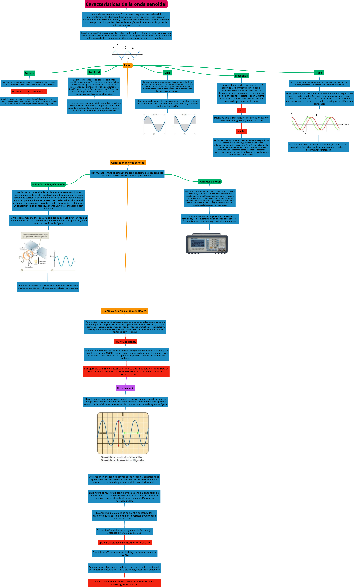
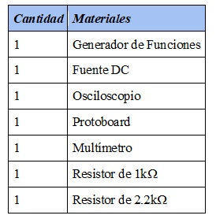
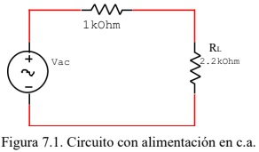

# PRÁCTICA No. 8 Características de la onda senoidal

#### Integrantes:

CALDERON VIDAL MATEO ESTEBAN

CAMACHO SIZA JOSUE EVERETT

GUEVARA CARVAJAL LUIS EDUARDO

#### NRC:

5406

## Objetivos

***Objetivo General***

- Comprender  el comportamiento de las ondas senoidales y con ello sus características en un circuito eléctrico.

***Objetivos específicos***

- Comprobar la efectividad del uso del osciloscopio y multímetro en el análisis de circuitos.

- Comprender la representación de la onda senoidal sea gráficamente y matemáticamente.

- Entender las conexiones y forma de uso del protoboard, del multímetro y de los demás materiales de laboratorio para hacer un uso correcto de ellos, ya que cada uno tiene una forma específica de uso.

## Marco teórico

## Explicación del procedimiento

***Material y equipo requerido***

*Tabla I. Materiales y Equipo*

***Pasos a seguir***

1. Iniciar el simulador y seleccionar los materiales a utilizar.
2. Preparar los materiales en el simulador: resistencia con cada valor, osciloscopio y la fuente de energía.
3. Elaborar un circuito con los materiales con la forma indicada en la guía.
4. Analice lo que ocurre con el osciloscopio en la resistencia de carga RL.
5. Contestar las preguntas con cada uno de los resultados obtenidos.

***Procedimiento***

## Resultados

Responda las siguientes preguntas:

- **¿Cuántas divisiones por cuadro abarca la amplitud pico de la señal de salida?**

- **¿En qué valor está posicionada la perilla VOLTS/DIV?**

La perilla de VOLTS/DIV esta en: 3

- **¿Cuántas divisiones por cuadro abarca un ciclo completo de la señal de salida?**

- **¿En qué valor está posicionada la perilla TIME/DIV?**

La perilla de TIME/DIV esta en: 0.1ms

- **7.5.5. ¿Cuál es la amplitud de voltaje y el periodo de la señal que aparece en la pantalla del osciloscopio?**

*Amplitud de voltaje: **6.85** (V)*

*Periodo: **0.0004** (s)*

- **Determine la frecuencia natural (Hz) y la frecuencia angula (rad/s) de la señal de salida.**

*f: **2500** (Hz)*

*w: 2π * 2500 = **1507.9** (rad/s)*

- **7.5.7. Con el multímetro digital mida el voltaje de salida en RL:**

- **Compare el voltaje medido en el punto 7.5.5. y el obtenido en el punto 7.5.7.**

*¿Coinciden? _______ ¿Por qué?*

## Video

## Conclusiones

## Bibliografía 

- Boylestad, R. 2011. Introducción al análisis de circuitos. 12va. Edición. Pearson. 327-376.

- Figueroa, D. 2006. Laboratorio de Física 2. Editorial Equinoccio. 03-1 y 14-1.

- Ondas senoidales. Recobrado de: iessierradeguara.com

- Serway, R. 2008.Física para Ciencias e Ingeniería. Volumen 2. Cengage Learning. 881- 884
