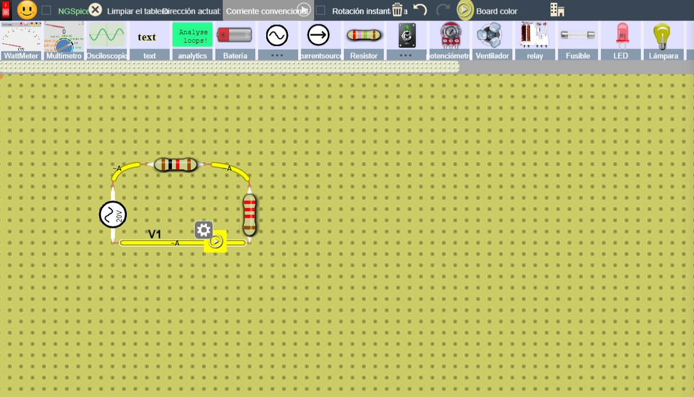
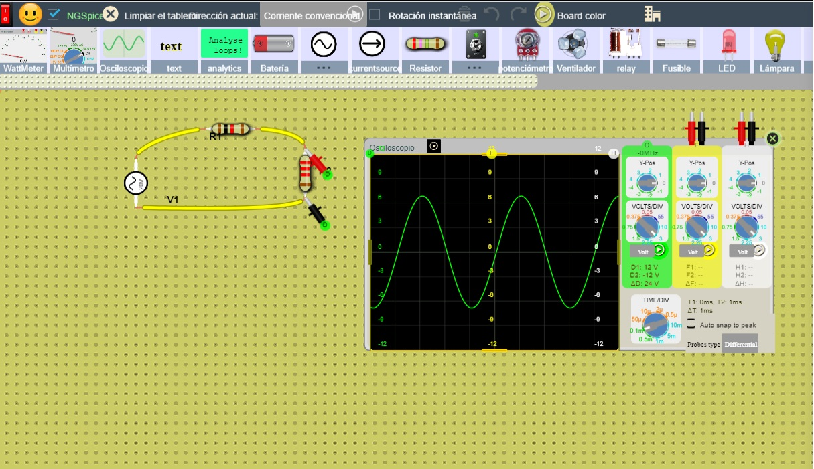
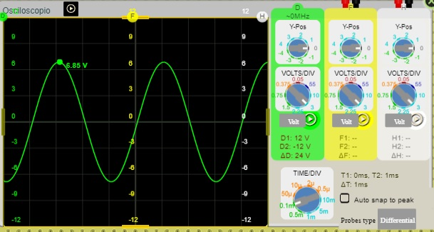
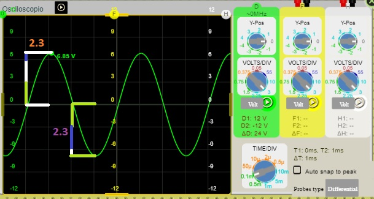
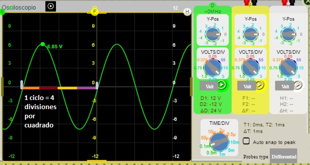
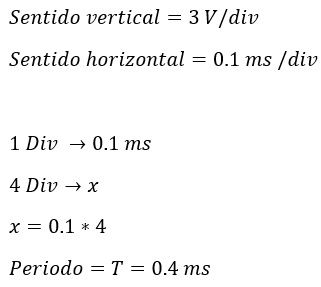
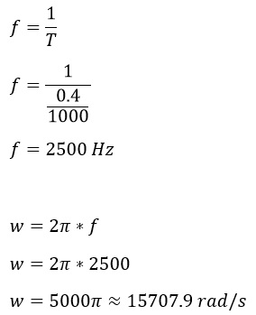
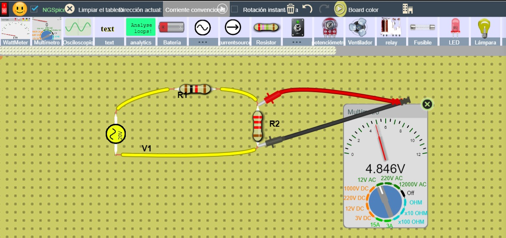
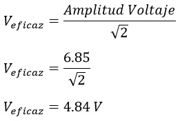
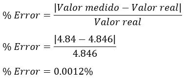

# PRÁCTICA No. 8 Características de la onda senoidal

#### Integrantes:

CALDERON VIDAL MATEO ESTEBAN

CAMACHO SIZA JOSUE EVERETT

GUEVARA CARVAJAL LUIS EDUARDO

#### NRC:

5406

## Objetivos

***Objetivo General***

- Comprender  el comportamiento de las ondas senoidales y con ello sus características en un circuito eléctrico.

***Objetivos específicos***

- Comprobar la efectividad del uso del osciloscopio y multímetro en el análisis de circuitos.

- Comprender la representación de la onda senoidal sea gráficamente y matemáticamente.

- Entender las conexiones y forma de uso del protoboard, del multímetro y de los demás materiales de laboratorio para hacer un uso correcto de ellos, ya que cada uno tiene una forma específica de uso.

## Marco teórico

## Explicación del procedimiento

***Material y equipo requerido***

*Tabla I. Materiales y Equipo*

***Pasos a seguir***

1. Iniciar el simulador y seleccionar los materiales a utilizar.
2. Preparar los materiales en el simulador: resistencia con cada valor, osciloscopio y la fuente de energía.
3. Elaborar un circuito con los materiales con la forma indicada en la guía.
4. Analice lo que ocurre con el osciloscopio en la resistencia de carga RL.
5. Contestar las preguntas con cada uno de los resultados obtenidos.

***Procedimiento***

Armamos el circuito de la figura:

Conectamos nuestro osciloscopio:

Analizamos la grafica senoidal que nos da el osciloscopio:

Division por cuadro que abarca la amplitud pico de la señal de salida:

Division por cuadro abarca un ciclo completo de la señal de salida:

Calculado el periodo:

Calculando la frecuencia natural y angular:

Midiendo con el Múltimetro el voltaje de salida en RL:

Calculando el valor eficaz del Voltaje obtenido mediante el osciloscopio:

## Resultados

Responda las siguientes preguntas:

- **a. ¿Cuántas divisiones por cuadro abarca la amplitud pico de la señal de salida?**

La amplitud pico de subida de la señal es un valor aproximado de 2.3 divisiones por cuadro, mediante el grafico podemos observar que pasa lo mismo pero para la amplitud de bajada mediante lo cual podemos decir que el valor aproximado de la amplitud pico de la señal de salida es de 4.6 divisiones por cuadro.

- **b. ¿En qué valor está posicionada la perilla VOLTS/DIV?**

La perilla de VOLTS/DIV esta en: 3

- **c. ¿Cuántas divisiones por cuadro abarca un ciclo completo de la señal de salida?**

Un ciclo completo de la señal de salida abarca un aproximado de 4 divisiones por cuadrado.

- **d. ¿En qué valor está posicionada la perilla TIME/DIV?**

La perilla de TIME/DIV esta en: 0.1ms

- **e. ¿Cuál es la amplitud de voltaje y el periodo de la señal que aparece en la pantalla del osciloscopio?**

*Amplitud de voltaje: **6.85** (V)*

*Periodo: **0.0004** (s)*

- **f. Determine la frecuencia natural (Hz) y la frecuencia angular (rad/s) de la señal de salida.**

*f: **2500** (Hz)*

*w: **1507.9** (rad/s)*

- **g. Con el multímetro digital mida el voltaje de salida en RL:**

El voltaje de salida en RL obtenido mediante el multímetro digital es aproximado de 4.846 V.

- **Compare el voltaje medido en el punto (e) y el obtenido en el punto (g)**

*¿Coinciden?, ¿Por qué?*

Se puede decir que no coinciden ya que con el múltimetro se calcula el voltaje RMS o eficaz y con el osciloscopio se obtiene el voltaje pico, para poder obtener nuestro voltaje eficaz se hizo el calculo respectivo, y se comprobo que son parecidos.

***% ERROR RELATIVO***

## Video

## Conclusiones

- Esta práctica fue de gran ayuda puesto que mejoramos nuestros conocimientos sobre el uso del Osciloscopio, además que mediante la simulación se aprendio más del uso de este tipo de aparatos electronicos que llegaremos a usar en nuestra carrera y en nuestra vida laboral.

## Bibliografía 

- Boylestad, R. 2011. Introducción al análisis de circuitos. 12va. Edición. Pearson. 327-376.

- Figueroa, D. 2006. Laboratorio de Física 2. Editorial Equinoccio. 03-1 y 14-1.

- Ondas senoidales. Recobrado de: iessierradeguara.com

- Serway, R. 2008.Física para Ciencias e Ingeniería. Volumen 2. Cengage Learning. 881- 884
